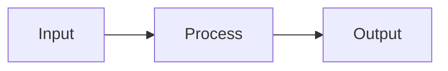
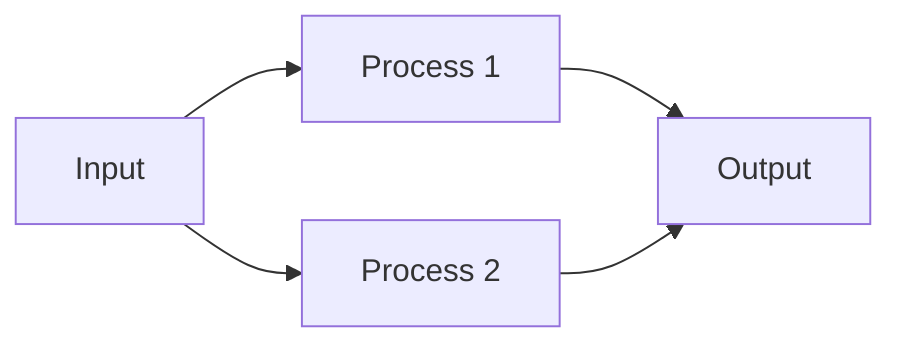

## Understanding Workflows

Workflows in WaveAssist represent the complete pipeline of your AI operations, connecting multiple nodes to create automated processes.

### Workflow Components

<CardGroup>
  <Card title="Node Connections" icon="diagram-project">
    Define how data flows between nodes
  </Card>
  <Card title="Scheduling" icon="clock">
    Automate workflow execution
  </Card>
  <Card title="Error Handling" icon="shield">
    Manage failures and retries
  </Card>
  <Card title="Monitoring" icon="chart-line">
    Track performance and status
  </Card>
</CardGroup>

## Creating Workflows

```python
from waveassist import WAHelper

# Initialize helper
helper = WAHelper('your-project-key')

# Define workflow
workflow = helper.create_workflow('data_pipeline')

# Add nodes to workflow
workflow.add_node('data_ingestion')
workflow.add_node('data_processing')
workflow.add_node('model_training')

# Connect nodes
workflow.connect('data_ingestion', 'data_processing')
workflow.connect('data_processing', 'model_training')

# Set workflow schedule
workflow.schedule('0 0 * * *')  # Daily at midnight
```

## Workflow Patterns

### Sequential Processing


### Parallel Processing


## Best Practices

1. **Modular Design**: Break complex workflows into smaller, reusable components
2. **Error Recovery**: Implement proper error handling and recovery mechanisms
3. **Monitoring**: Set up alerts for critical workflow stages
4. **Version Control**: Maintain workflow versions for easy rollback
5. **Documentation**: Keep workflow documentation up to date
